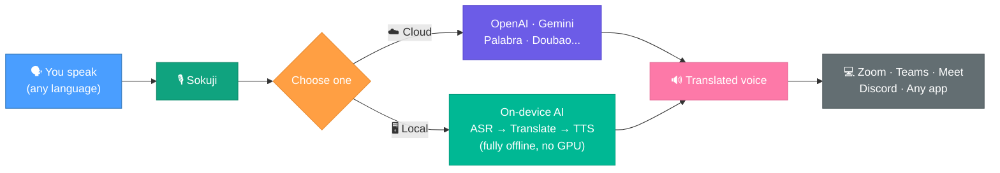

<p align="center">
  
</p>

<h3 align="center">Real-time speech translation — cloud or fully offline on your device</h3>

<p align="center">
  <a href="LICENSE" target="_blank">
    
  </a>
  <a href="https://github.com/kizuna-ai-lab/sokuji/actions/workflows/build.yml" target="_blank">
    
  </a>
  <a href="https://github.com/kizuna-ai-lab/sokuji/releases" target="_blank">
    
  </a>
  
  <a href="https://deepwiki.com/kizuna-ai-lab/sokuji" target="_blank">
    
  </a>
</p>

<p align="center">
  English | <a href="docs/README.ja.md">日本語</a> | <a href="docs/README.zh.md">中文</a>
</p>

---

## Why Sokuji?

Built by [Kizuna AI Lab](https://github.com/kizuna-ai-lab) — we use AI to break language and accessibility barriers, creating genuine human connections. "Kizuna" (絆) means "bond" in Japanese, and Sokuji (即時) is our flagship tool to make real-time communication possible across any language.

Sokuji is a cross-platform live speech translation app for desktop and browser. It supports **Local Inference** — on-device ASR, translation, and TTS powered by WASM and WebGPU, with no API key required, no expensive GPU needed, fully offline, and completely private. It also integrates with cloud providers including OpenAI, Google Gemini, Palabra.ai, Kizuna AI, Doubao AST 2.0, and OpenAI-compatible APIs.

---

## How It Works



| | |
|---|---|
| **Providers** | 7 — OpenAI, Gemini, Palabra.ai, Kizuna AI, Doubao AST 2.0, OpenAI Compatible, Local Inference |
| **Local Models** | 48 ASR models, 55+ translation pairs, 136 TTS voices |
| **Languages** | 99+ (speech recognition) · 55+ (translation) · 53 (text-to-speech) |
| **Platforms** | Linux · Windows · macOS · Chrome · Edge |
| **Privacy** | Local Inference = 100% on-device, no API key, no internet |

---

## Demo

https://github.com/user-attachments/assets/1eaaa333-a7ce-4412-a295-16b7eb2310de

---

## Install

Sokuji is available as a **Desktop App** and a **Browser Extension** — same features, different reach.

| | Desktop App | Browser Extension |
|---|---|---|
| **Features** | All features identical | All features identical |
| **Use with** | Any app with mic input — Zoom, Teams, Discord, Slack, games, OBS, and more | Web-based meeting platforms — Google Meet, Teams, Zoom, Discord, Slack, Gather.town, Whereby |
| **Install** | Download & install | Zero install — add from store |
| **Platforms** | Windows · macOS · Linux | Chrome · Edge · Brave (coming soon) |

### Desktop App

Download from the [Releases page](https://github.com/kizuna-ai-lab/sokuji/releases):

| Platform | Package |
|----------|---------|
| Windows | `Sokuji-x.y.z.Setup.exe` |
| macOS (Apple Silicon) | `Sokuji-x.y.z-arm64.pkg` |
| macOS (Intel) | `Sokuji-x.y.z-x64.pkg` |
| Linux (Debian/Ubuntu x64) | `sokuji_x.y.z_amd64.deb` |
| Linux (Debian/Ubuntu ARM64) | `sokuji_x.y.z_arm64.deb` |

### Browser Extension

<p>
  <a href="https://chromewebstore.google.com/detail/ppmihnhelgfpjomhjhpecobloelicnak?utm_source=item-share-cb" target="_blank">
    
  </a>
  <a href="https://microsoftedge.microsoft.com/addons/detail/sokuji-aipowered-live-/dcmmcdkeibkalgdjlahlembodjhijhkm" target="_blank">
    
  </a>
</p>

<details>
<summary>Install extension in Developer Mode</summary>

1. Download `sokuji-extension.zip` from the [Releases page](https://github.com/kizuna-ai-lab/sokuji/releases)
2. Extract the zip file
3. Go to `chrome://extensions/` and enable "Developer mode"
4. Click "Load unpacked" and select the extracted folder

</details>

### Build from Source

```bash
git clone https://github.com/kizuna-ai-lab/sokuji.git
cd sokuji && npm install
npm run electron:dev        # Development
npm run electron:build      # Production
```

---

## Features

### Local Inference (Edge AI)

Run everything on your device — no API keys, no internet, no expensive GPU, complete privacy. Powered by WASM and WebGPU, Sokuji runs efficiently on any modern browser using your existing CPU and integrated graphics.

- **50 ASR models** (32 offline + 10 streaming + 8 WebGPU including Whisper, Cohere Transcribe, Voxtral Mini 4B) covering 99+ languages
- **55+ translation pairs** via Opus-MT + 5 multilingual LLMs (Qwen 2.5 / 3 / 3.5, GemmaTranslate) with WebGPU
- **136 TTS voices** across 53 languages (Piper, Piper-Plus, Coqui, Mimic3, Matcha engines)
- One-click model download with IndexedDB caching

### Cloud Providers

| Provider | Key Feature |
|----------|-------------|
| **OpenAI** | `gpt-realtime-mini` / `gpt-realtime-1.5` · 10 voices · configurable turn detection (Normal / Semantic / Disabled) · noise reduction · 60+ languages |
| **Google Gemini** | Dynamic model selection (audio/live models) · 30 voices · built-in turn detection · 34 language variants |
| **Palabra.ai** | WebRTC low-latency · voice cloning · auto sentence segmentation · partial transcription translation · 60+ source / 40+ target languages |
| **Kizuna AI** | Sign in and go — API key managed by backend · same OpenAI models with optimized defaults |
| **Doubao AST 2.0** | Speech-to-speech with speaker voice cloning · bidirectional Chinese↔English · Ogg Opus audio output |
| **OpenAI Compatible** | Bring your own endpoint — any OpenAI Realtime API-compatible service (Electron only) |
| **Local Inference** | Fully offline · ASR → Translation → TTS on-device · no API key · no GPU required |

### Audio

- **Translate your voice** — speak in your language, others hear the translation as if you spoke it natively
- **Translate others' voice** — capture meeting audio (extension) or any system audio (desktop) and get real-time translated subtitles
- **Virtual Microphone** — route translated audio to Zoom, Meet, Teams, or any app
- **Real-time Passthrough** — monitor your own voice while recording
- **AI Noise Suppression** — removes background noise, keyboard sounds, and other distractions
- **Echo Cancellation** — built-in with modern Web Audio API

### Interface

- **30 languages** — fully localized UI
- **Simple Mode** — streamlined setup for non-technical users
- **Advanced Mode** — waveform display and detailed controls

---

## Privacy

**Your audio stays on your device — if you choose Local Inference, nothing ever leaves.**

- Cloud mode connects **directly** to provider APIs — no intermediary servers
- API keys stored **locally only**, never transmitted to us
- Local Inference processes everything **on-device** with zero network requests
- Anonymous usage analytics via PostHog

---

## Tech Stack

- **Desktop**: [Electron](https://www.electronjs.org) (Windows, macOS, Linux)
- **Extension**: Chrome/Edge Manifest V3
- **UI**: [React](https://react.dev) + TypeScript + [Zustand](https://zustand-demo.pmnd.rs/)
- **Local AI**: [sherpa-onnx](https://github.com/k2-fsa/sherpa-onnx) (WASM) · [Transformers.js](https://github.com/huggingface/transformers.js) · WebGPU
- **Audio**: Web Audio API · AudioWorklet · WebRTC
- **i18n**: [i18next](https://www.i18next.com/) (30 languages)

---

## Contributing

We welcome contributions! Please read our [Contributing Guidelines](.github/CONTRIBUTING.md) before getting started.

---

## License

[AGPL-3.0](LICENSE)

## Sponsors

<table>
  <tr>
    <td><a href="https://signpath.org/"></a></td>
    <td>Free code signing on Windows provided by <a href="https://about.signpath.io/">SignPath.io</a>, certificate by <a href="https://signpath.org/">SignPath Foundation</a>.</td>
  </tr>
</table>

## Support

- [Issues](https://github.com/kizuna-ai-lab/sokuji/issues) — Bug reports
- [Discussions](https://github.com/kizuna-ai-lab/sokuji/discussions) — Questions & ideas

## Acknowledgments

- **Cloud APIs**: [OpenAI](https://openai.com), [Google Gemini](https://ai.google.dev), [Volcengine](https://www.volcengine.com)
- **ASR**: [sherpa-onnx](https://github.com/k2-fsa/sherpa-onnx), [OpenAI Whisper](https://github.com/openai/whisper), [SenseVoice](https://github.com/FunAudioLLM/SenseVoice), [Moonshine](https://github.com/usefulsensors/moonshine), [Cohere Transcribe](https://cohere.com), [Voxtral Mini 4B](https://github.com/mistralai)
- **TTS**: [Piper](https://github.com/rhasspy/piper), [Piper-Plus](https://github.com/ayutaz/piper-plus), [Matcha-TTS](https://github.com/shivammehta25/Matcha-TTS), [Coqui TTS](https://github.com/coqui-ai/TTS), [Mimic 3](https://github.com/MycroftAI/mimic3)
- **Translation**: [Opus-MT](https://github.com/Helsinki-NLP/Opus-MT), [Qwen](https://github.com/QwenLM/Qwen), [GemmaTranslate](https://github.com/google-research/translate-gemma)
- **Infra**: [Transformers.js](https://github.com/huggingface/transformers.js), [ONNX Runtime](https://github.com/microsoft/onnxruntime), [Electron](https://www.electronjs.org), [React](https://react.dev)

For detailed model licenses, see [THIRD_PARTY_NOTICES.md](THIRD_PARTY_NOTICES.md).
