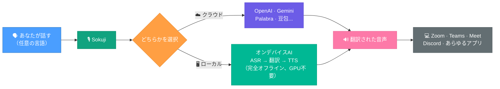

<p align="center">
  
</p>

<h3 align="center">リアルタイム音声翻訳 — クラウドまたは完全オフラインでデバイス上で動作</h3>

<p align="center">
  <a href="../LICENSE" target="_blank">
    
  </a>
  <a href="https://github.com/kizuna-ai-lab/sokuji/actions/workflows/build.yml" target="_blank">
    
  </a>
  <a href="https://github.com/kizuna-ai-lab/sokuji/releases" target="_blank">
    
  </a>
  
  <a href="https://deepwiki.com/kizuna-ai-lab/sokuji" target="_blank">
    
  </a>
</p>

<p align="center">
  <a href="../README.md">English</a> | 日本語 | <a href="README.zh.md">中文</a>
</p>

---

## なぜSokujiなのか？

[Kizuna AI Lab](https://github.com/kizuna-ai-lab) が開発 — AIを活用して言語とアクセシビリティの壁を打ち破り、人と人との真のつながりを創造します。「絆」は日本語で「bond」、即時（Sokuji）はリアルタイムコミュニケーションを可能にするフラッグシップツールです。

Sokujiは、デスクトップとブラウザに対応したクロスプラットフォームのリアルタイム音声翻訳アプリです。**ローカル推論**をサポート — WASMとWebGPUによるオンデバイスASR・翻訳・TTSで、APIキー不要、高価なGPU不要、完全オフライン、プライバシー完全保護。OpenAI、Google Gemini、Palabra.ai、Kizuna AI、豆包 AST 2.0、OpenAI互換APIなどのクラウドプロバイダーにも対応。

---

## 仕組み



| | |
|---|---|
| **プロバイダー** | 7 — OpenAI、Gemini、Palabra.ai、Kizuna AI、豆包 AST 2.0、OpenAI互換、ローカル推論 |
| **ローカルモデル** | ASR 50モデル、翻訳 55以上の言語ペア、TTS 136ボイス |
| **言語** | 99以上（音声認識）· 55以上（翻訳）· 53（音声合成） |
| **プラットフォーム** | Linux · Windows · macOS · Chrome · Edge |
| **プライバシー** | ローカル推論 = 100%オンデバイス、APIキー不要、インターネット不要 |

---

## デモ

https://github.com/user-attachments/assets/1eaaa333-a7ce-4412-a295-16b7eb2310de

---

## インストール

Sokujiは**デスクトップアプリ**と**ブラウザ拡張機能**の両方で利用可能 — 同じ機能、異なる利用範囲。

| | デスクトップアプリ | ブラウザ拡張機能 |
|---|---|---|
| **機能** | すべて同一 | すべて同一 |
| **使用先** | マイク入力に対応するあらゆるアプリ — Zoom、Teams、Discord、Slack、ゲーム、OBSなど | ウェブベースの会議プラットフォーム — Google Meet、Teams、Zoom、Discord、Slack、Gather.town、Whereby |
| **インストール** | ダウンロード＆インストール | インストール不要 — ストアから追加 |
| **プラットフォーム** | Windows · macOS · Linux | Chrome · Edge |

### デスクトップアプリ

[リリースページ](https://github.com/kizuna-ai-lab/sokuji/releases)からダウンロード：

| プラットフォーム | パッケージ |
|----------|---------|
| Windows | `Sokuji-x.y.z.Setup.exe` |
| macOS (Apple Silicon) | `Sokuji-x.y.z-arm64.pkg` |
| macOS (Intel) | `Sokuji-x.y.z-x64.pkg` |
| Linux (Debian/Ubuntu x64) | `sokuji_x.y.z_amd64.deb` |
| Linux (Debian/Ubuntu ARM64) | `sokuji_x.y.z_arm64.deb` |

### ブラウザ拡張機能

<p>
  <a href="https://chromewebstore.google.com/detail/ppmihnhelgfpjomhjhpecobloelicnak?utm_source=item-share-cb" target="_blank">
    
  </a>
  <a href="https://microsoftedge.microsoft.com/addons/detail/sokuji-aipowered-live-/dcmmcdkeibkalgdjlahlembodjhijhkm" target="_blank">
    
  </a>
</p>

<details>
<summary>開発者モードで拡張機能をインストール</summary>

1. [リリースページ](https://github.com/kizuna-ai-lab/sokuji/releases)から`sokuji-extension.zip`をダウンロード
2. zipファイルを解凍
3. `chrome://extensions/`にアクセスし「デベロッパーモード」を有効化
4. 「パッケージ化されていない拡張機能を読み込む」をクリックし、解凍したフォルダを選択

</details>

### ソースからビルド

```bash
git clone https://github.com/kizuna-ai-lab/sokuji.git
cd sokuji && npm install
npm run electron:dev        # 開発モード
npm run electron:build      # 本番ビルド
```

---

## 機能

### ローカル推論（エッジAI）

すべてをデバイス上で実行 — APIキー不要、インターネット不要、高価なGPU不要、完全なプライバシー。WASMとWebGPUにより、既存のCPUと内蔵グラフィックスで効率的に動作。

- **50 ASRモデル**（オフライン32 + ストリーミング10 + WebGPU 8：Whisper、Cohere Transcribe、Voxtral Mini 4Bを含む）99以上の言語をカバー
- **55以上の翻訳ペア** Opus-MT + 5つの多言語LLM（Qwen 2.5 / 3 / 3.5、GemmaTranslate）WebGPU対応
- **136 TTSボイス** 53言語（Piper、Piper-Plus、Coqui、Mimic3、Matchaエンジン）
- ワンクリックモデルダウンロード、IndexedDBキャッシュ

### クラウドプロバイダー

| プロバイダー | 主な特徴 |
|----------|-------------|
| **OpenAI** | `gpt-realtime-mini` / `gpt-realtime-1.5` · 10ボイス · 設定可能なターン検出（通常 / セマンティック / 無効）· ノイズリダクション · 60以上の言語 |
| **Google Gemini** | 動的モデル選択（audio/liveモデル）· 30ボイス · 内蔵ターン検出 · 34言語バリアント |
| **Palabra.ai** | WebRTC低遅延 · ボイスクローニング · 自動文分割 · 部分転写翻訳 · 60以上のソース / 40以上のターゲット言語 |
| **Kizuna AI** | サインインするだけ — APIキーはバックエンド管理 · OpenAIモデルを最適化されたデフォルトで |
| **豆包 AST 2.0** | 話者ボイスクローニング付き音声翻訳 · 中国語↔英語双方向 · Ogg Opus音声出力 |
| **OpenAI互換** | 独自エンドポイント対応 — OpenAI Realtime API互換サービス（Electronのみ） |
| **ローカル推論** | 完全オフライン · ASR → 翻訳 → TTSをオンデバイスで · APIキー不要 · GPU不要 |

### オーディオ

- **あなたの声を翻訳** — あなたの言語で話すと、相手にはまるでネイティブで話したかのように翻訳された音声が届きます
- **相手の声を翻訳** — 会議音声（拡張機能）またはシステム音声（デスクトップ）をキャプチャし、リアルタイム翻訳字幕を取得
- **仮想マイク** — 翻訳された音声をZoom、Meet、Teams、あらゆるアプリに送信
- **リアルタイムパススルー** — 録音中に自分の声をモニタリング
- **AIノイズ抑制** — 背景ノイズ、キーボード音などを除去
- **エコーキャンセレーション** — Web Audio APIによるビルトイン

### インターフェース

- **30言語** — 完全ローカライズされたUI
- **シンプルモード** — 非技術ユーザー向けの簡素化された設定
- **アドバンスモード** — 波形表示と詳細コントロール

---

## プライバシー

**ローカル推論を選択すれば、あなたの音声はデバイスから一切外に出ません。**

- クラウドモードはプロバイダーAPIに**直接接続** — 中間サーバーなし
- APIキーは**ローカルにのみ保存** — 私たちに送信されることはありません
- ローカル推論はすべてを**デバイス上で処理** — ネットワークリクエストゼロ
- PostHogによる匿名使用状況分析

---

## 技術スタック

- **デスクトップ**: [Electron](https://www.electronjs.org) (Windows, macOS, Linux)
- **拡張機能**: Chrome/Edge Manifest V3
- **UI**: [React](https://react.dev) + TypeScript + [Zustand](https://zustand-demo.pmnd.rs/)
- **ローカルAI**: [sherpa-onnx](https://github.com/k2-fsa/sherpa-onnx) (WASM) · [Transformers.js](https://github.com/huggingface/transformers.js) · WebGPU
- **オーディオ**: Web Audio API · AudioWorklet · WebRTC
- **i18n**: [i18next](https://www.i18next.com/) (30言語)

---

## コントリビュート

コントリビュートを歓迎します！まず[コントリビュートガイドライン](../.github/CONTRIBUTING.md)をお読みください。

---

## ライセンス

[AGPL-3.0](../LICENSE)

## サポート

- [Issues](https://github.com/kizuna-ai-lab/sokuji/issues) — バグ報告
- [Discussions](https://github.com/kizuna-ai-lab/sokuji/discussions) — 質問＆アイデア

## 謝辞

- **クラウドAPI**: [OpenAI](https://openai.com), [Google Gemini](https://ai.google.dev), [Volcengine](https://www.volcengine.com)
- **ASR**: [sherpa-onnx](https://github.com/k2-fsa/sherpa-onnx), [OpenAI Whisper](https://github.com/openai/whisper), [SenseVoice](https://github.com/FunAudioLLM/SenseVoice), [Moonshine](https://github.com/usefulsensors/moonshine), [Cohere Transcribe](https://cohere.com), [Voxtral Mini 4B](https://github.com/mistralai)
- **TTS**: [Piper](https://github.com/rhasspy/piper), [Piper-Plus](https://github.com/ayutaz/piper-plus), [Matcha-TTS](https://github.com/shivammehta25/Matcha-TTS), [Coqui TTS](https://github.com/coqui-ai/TTS), [Mimic 3](https://github.com/MycroftAI/mimic3)
- **翻訳**: [Opus-MT](https://github.com/Helsinki-NLP/Opus-MT), [Qwen](https://github.com/QwenLM/Qwen), [GemmaTranslate](https://github.com/google-research/translate-gemma)
- **インフラ**: [Transformers.js](https://github.com/huggingface/transformers.js), [ONNX Runtime](https://github.com/microsoft/onnxruntime), [Electron](https://www.electronjs.org), [React](https://react.dev)

モデルライセンスの詳細は[THIRD_PARTY_NOTICES.md](../THIRD_PARTY_NOTICES.md)をご参照ください。
