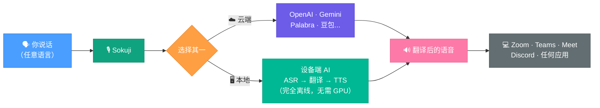

<p align="center">
  
</p>

<h3 align="center">实时语音翻译 — 云端或完全离线在您的设备上运行</h3>

<p align="center">
  <a href="../LICENSE" target="_blank">
    
  </a>
  <a href="https://github.com/kizuna-ai-lab/sokuji/actions/workflows/build.yml" target="_blank">
    
  </a>
  <a href="https://github.com/kizuna-ai-lab/sokuji/releases" target="_blank">
    
  </a>
  
  <a href="https://deepwiki.com/kizuna-ai-lab/sokuji" target="_blank">
    
  </a>
</p>

<p align="center">
  <a href="../README.md">English</a> | <a href="README.ja.md">日本語</a> | 中文
</p>

---

## 为什么选择 Sokuji？

由 [Kizuna AI Lab](https://github.com/kizuna-ai-lab) 开发 — 我们利用 AI 打破语言和无障碍壁垒，创造真正的人与人之间的连接。"絆"（Kizuna）在日语中意为"羁绊"，即時（Sokuji）是我们让跨语言实时沟通成为可能的旗舰工具。

Sokuji 是一款跨平台实时语音翻译应用，同时支持桌面端和浏览器端。支持**本地推理** — 通过 WASM 和 WebGPU 在设备上运行 ASR、翻译和 TTS，无需 API 密钥，无需昂贵的 GPU，完全离线，隐私完全保护。同时集成 OpenAI、Google Gemini、Palabra.ai、Kizuna AI、豆包 AST 2.0 和 OpenAI 兼容 API 等云端服务商。

---

## 工作原理



| | |
|---|---|
| **服务商** | 7 — OpenAI、Gemini、Palabra.ai、Kizuna AI、豆包 AST 2.0、OpenAI 兼容、本地推理 |
| **本地模型** | 50 个 ASR 模型、55+ 翻译语言对、136 个 TTS 语音 |
| **语言** | 99+（语音识别）· 55+（翻译）· 53（语音合成） |
| **平台** | Linux · Windows · macOS · Chrome · Edge |
| **隐私** | 本地推理 = 100% 设备端运行，无需 API 密钥，无需联网 |

---

## 演示

https://github.com/user-attachments/assets/1eaaa333-a7ce-4412-a295-16b7eb2310de

---

## 安装

Sokuji 提供**桌面应用**和**浏览器扩展**两种形式 — 功能完全相同，适用范围不同。

| | 桌面应用 | 浏览器扩展 |
|---|---|---|
| **功能** | 完全相同 | 完全相同 |
| **适用场景** | 支持麦克风输入的任何应用 — Zoom、Teams、Discord、Slack、游戏、OBS 等 | 网页端会议平台 — Google Meet、Teams、Zoom、Discord、Slack、Gather.town、Whereby |
| **安装** | 下载安装 | 免安装 — 从商店添加 |
| **平台** | Windows · macOS · Linux | Chrome · Edge |

### 桌面应用

从[发布页面](https://github.com/kizuna-ai-lab/sokuji/releases)下载：

| 平台 | 安装包 |
|----------|---------|
| Windows | `Sokuji-x.y.z.Setup.exe` |
| macOS (Apple Silicon) | `Sokuji-x.y.z-arm64.pkg` |
| macOS (Intel) | `Sokuji-x.y.z-x64.pkg` |
| Linux (Debian/Ubuntu x64) | `sokuji_x.y.z_amd64.deb` |
| Linux (Debian/Ubuntu ARM64) | `sokuji_x.y.z_arm64.deb` |

### 浏览器扩展

<p>
  <a href="https://chromewebstore.google.com/detail/ppmihnhelgfpjomhjhpecobloelicnak?utm_source=item-share-cb" target="_blank">
    
  </a>
  <a href="https://microsoftedge.microsoft.com/addons/detail/sokuji-aipowered-live-/dcmmcdkeibkalgdjlahlembodjhijhkm" target="_blank">
    
  </a>
</p>

<details>
<summary>以开发者模式安装扩展</summary>

1. 从[发布页面](https://github.com/kizuna-ai-lab/sokuji/releases)下载 `sokuji-extension.zip`
2. 解压缩文件
3. 访问 `chrome://extensions/` 并启用"开发者模式"
4. 点击"加载已解压的扩展程序"并选择解压后的文件夹

</details>

### 从源码构建

```bash
git clone https://github.com/kizuna-ai-lab/sokuji.git
cd sokuji && npm install
npm run electron:dev        # 开发模式
npm run electron:build      # 生产构建
```

---

## 功能特性

### 本地推理（边缘 AI）

一切在设备上运行 — 无需 API 密钥，无需联网，无需昂贵的 GPU，完全保护隐私。通过 WASM 和 WebGPU，Sokuji 使用您现有的 CPU 和集成显卡即可高效运行。

- **50 个 ASR 模型**（32 个离线 + 10 个流式 + 8 个 WebGPU，包括 Whisper、Cohere Transcribe、Voxtral Mini 4B）覆盖 99+ 种语言
- **55+ 翻译语言对** 通过 Opus-MT + 5 个多语言 LLM（Qwen 2.5 / 3 / 3.5、GemmaTranslate）支持 WebGPU
- **136 个 TTS 语音** 覆盖 53 种语言（Piper、Piper-Plus、Coqui、Mimic3、Matcha 引擎）
- 一键模型下载，IndexedDB 缓存

### 云端服务商

| 服务商 | 核心特性 |
|----------|-------------|
| **OpenAI** | `gpt-realtime-mini` / `gpt-realtime-1.5` · 10 种语音 · 可配置轮次检测（普通 / 语义 / 禁用）· 降噪 · 60+ 种语言 |
| **Google Gemini** | 动态模型选择（audio/live 模型）· 30 种语音 · 内置轮次检测 · 34 种语言变体 |
| **Palabra.ai** | WebRTC 低延迟 · 语音克隆 · 自动句子分割 · 部分转录翻译 · 60+ 源语言 / 40+ 目标语言 |
| **Kizuna AI** | 登录即用 — API 密钥由后端管理 · 使用优化默认设置的 OpenAI 模型 |
| **豆包 AST 2.0** | 带说话人语音克隆的语音翻译 · 中英双向翻译 · Ogg Opus 音频输出 |
| **OpenAI 兼容** | 自带端点 — 任何兼容 OpenAI Realtime API 的服务（仅限 Electron） |
| **本地推理** | 完全离线 · ASR → 翻译 → TTS 设备端运行 · 无需 API 密钥 · 无需 GPU |

### 音频

- **翻译您的声音** — 用您的语言说话，对方听到的翻译就像您用母语在说一样
- **翻译对方的声音** — 捕获会议音频（扩展）或任何系统音频（桌面），获取实时翻译字幕
- **虚拟麦克风** — 将翻译后的音频路由到 Zoom、Meet、Teams 或任何应用
- **实时直通** — 录音时监听自己的声音
- **AI 降噪** — 去除背景噪音、键盘声等干扰
- **回声消除** — 基于 Web Audio API 内置

### 界面

- **30 种语言** — 完全本地化的 UI
- **简洁模式** — 为非技术用户精简的设置
- **高级模式** — 波形显示和详细控制

---

## 隐私

**选择本地推理，您的音频绝不会离开设备。**

- 云端模式**直接连接**服务商 API — 没有中间服务器
- API 密钥**仅保存在本地** — 不会传输给我们
- 本地推理**在设备上处理一切** — 零网络请求
- 通过 PostHog 进行匿名使用分析

---

## 技术栈

- **桌面端**: [Electron](https://www.electronjs.org) (Windows, macOS, Linux)
- **扩展**: Chrome/Edge Manifest V3
- **UI**: [React](https://react.dev) + TypeScript + [Zustand](https://zustand-demo.pmnd.rs/)
- **本地 AI**: [sherpa-onnx](https://github.com/k2-fsa/sherpa-onnx) (WASM) · [Transformers.js](https://github.com/huggingface/transformers.js) · WebGPU
- **音频**: Web Audio API · AudioWorklet · WebRTC
- **i18n**: [i18next](https://www.i18next.com/) (30 种语言)

---

## 贡献

欢迎贡献！请先阅读我们的[贡献指南](../.github/CONTRIBUTING.md)。

---

## 许可证

[AGPL-3.0](../LICENSE)

## 赞助

<table>
  <tr>
    <td><a href="https://signpath.org/"></a></td>
    <td>Windows 代码签名由 <a href="https://about.signpath.io/">SignPath.io</a> 免费提供，证书由 <a href="https://signpath.org/">SignPath Foundation</a> 颁发。</td>
  </tr>
</table>

## 支持

- [Issues](https://github.com/kizuna-ai-lab/sokuji/issues) — Bug 报告
- [Discussions](https://github.com/kizuna-ai-lab/sokuji/discussions) — 提问与想法

## 致谢

- **云端 API**: [OpenAI](https://openai.com), [Google Gemini](https://ai.google.dev), [Volcengine](https://www.volcengine.com)
- **ASR**: [sherpa-onnx](https://github.com/k2-fsa/sherpa-onnx), [OpenAI Whisper](https://github.com/openai/whisper), [SenseVoice](https://github.com/FunAudioLLM/SenseVoice), [Moonshine](https://github.com/usefulsensors/moonshine), [Cohere Transcribe](https://cohere.com), [Voxtral Mini 4B](https://github.com/mistralai)
- **TTS**: [Piper](https://github.com/rhasspy/piper), [Piper-Plus](https://github.com/ayutaz/piper-plus), [Matcha-TTS](https://github.com/shivammehta25/Matcha-TTS), [Coqui TTS](https://github.com/coqui-ai/TTS), [Mimic 3](https://github.com/MycroftAI/mimic3)
- **翻译**: [Opus-MT](https://github.com/Helsinki-NLP/Opus-MT), [Qwen](https://github.com/QwenLM/Qwen), [GemmaTranslate](https://github.com/google-research/translate-gemma)
- **基础设施**: [Transformers.js](https://github.com/huggingface/transformers.js), [ONNX Runtime](https://github.com/microsoft/onnxruntime), [Electron](https://www.electronjs.org), [React](https://react.dev)

模型许可证详情请参阅 [THIRD_PARTY_NOTICES.md](../THIRD_PARTY_NOTICES.md)。
