# Sokuji Audio Flow Analysis - Mermaid Diagrams

## 1. Main Audio Flow Path

```mermaid
graph TD
    A[🎤 Physical Microphone<br/>getUserMedia] --> B[📼 wav_recorder<br/>AudioWorkletNode]
    B --> C[🤖 AI Client<br/>Processing]
    C --> D[🔊 wav_stream_player<br/>Playback]
    D --> E[🔊 Physical Speakers<br/>AudioContext.destination]
    D --> F[🎤 Virtual Microphone<br/>sendPcmDataToTabs]
    
    %% Feedback loops
    B -.-> G[🔄 Passthrough<br/>Real Voice]
    G --> D
    E -.-> A
    
    %% Styling
    classDef input fill:#4facfe,stroke:#333,stroke-width:2px,color:#fff
    classDef recorder fill:#43e97b,stroke:#333,stroke-width:2px,color:#fff
    classDef ai fill:#fa709a,stroke:#333,stroke-width:2px,color:#fff
    classDef player fill:#a8edea,stroke:#333,stroke-width:2px,color:#333
    classDef output fill:#ff9a9e,stroke:#333,stroke-width:2px,color:#333
    classDef echo fill:#ff6b6b,stroke:#333,stroke-width:2px,color:#fff
    
    class A input
    class B recorder
    class C ai
    class D player
    class E,F output
    class G echo
```



## 2. Detailed Echo Feedback Loops


## 3. Browser AEC Failure Analysis

```mermaid
graph TB
    subgraph "Standard AEC (Works)"
        A1[🎤 Microphone Input] --> B1[Browser AEC Algorithm]
        C1[🔊 Standard Audio Element<br/>&lt;audio&gt;/&lt;video&gt;/WebRTC] --> B1
        B1 --> D1[✅ Clean Audio Output]
        
        B1 -.-> E1[Reference Signal Available]
        E1 -.-> F1[Can subtract echo]
    end
    
    subgraph "Sokuji AEC (Fails)"
        A2[🎤 Microphone Input] --> B2[Browser AEC Algorithm]
        C2[🔊 AudioWorkletNode<br/>Programmatic Audio] -.-> B2
        B2 --> D2[❌ Still Has Echo]
        
        B2 -.-> E2[❌ Reference Signal Invisible]
        E2 -.-> F2[❌ Cannot identify source]
    end
    
    classDef works fill:#e8f5e8,stroke:#4caf50,stroke-width:2px
    classDef fails fill:#ffebee,stroke:#f44336,stroke-width:2px
    classDef aec fill:#e3f2fd,stroke:#2196f3,stroke-width:2px
    
    class A1,C1,D1,E1,F1 works
    class A2,C2,D2,E2,F2 fails
    class B1,B2 aec
```



## 4. Technical Implementation Flow


## 5. Solution Comparison

```mermaid
graph TD
    A[Audio Echo Problem] --> B{Solution Options}
    
    B --> C[🎧 Headphone Solution]
    B --> D[🔧 Software AEC Solution]
    B --> E[⚙️ Disable Passthrough]
    B --> F[🔄 Architecture Refactor]
    
    C --> C1[✅ 100% Effective]
    C --> C2[✅ No Performance Impact]
    C --> C3[✅ Immediate Solution]
    C --> C4[✅ No Code Changes]
    
    D --> D1[❓ Uncertain Effectiveness]
    D --> D2[❌ High CPU Usage]
    D --> D3[❌ Complex Implementation]
    D --> D4[❌ May Add Latency]
    
    E --> E1[✅ Partially Effective]
    E --> E2[✅ Low Implementation Cost]
    E --> E3[❌ Loses Real Voice Feature]
    
    F --> F1[✅ Possibly Effective]
    F --> F2[❌ Very High Complexity]
    F --> F3[❌ Major Breaking Changes]
    F --> F4[❌ High Performance Impact]
    
    classDef recommended fill:#e8f5e8,stroke:#4caf50,stroke-width:3px
    classDef partial fill:#fff3e0,stroke:#ff9800,stroke-width:2px
    classDef complex fill:#ffebee,stroke:#f44336,stroke-width:2px
    
    class C,C1,C2,C3,C4 recommended
    class E,E1,E2,E3 partial
    class D,D1,D2,D3,D4,F,F1,F2,F3,F4 complex
```



## 6. Audio Processing Architecture


## 7. Speaker Mode vs Headphone Mode

```mermaid
graph LR
    subgraph "Speaker Mode (Problem)"
        A1[🎤 Microphone] -.-> A2[🔊 Speakers]
        A2 -.-> A1
        A3[wav_stream_player] --> A2
        
        A4[❌ Physical + Digital Echo]
        A5[❌ Double Feedback Loop]
        A6[❌ Audio Quality Degradation]
    end
    
    subgraph "Headphone Mode (Solution)"
        B1[🎤 Microphone] -.-> B2[🎧 Headphones]
        B3[wav_stream_player] --> B2
        
        B4[✅ Physical Feedback Blocked]
        B5[✅ Only Software Echo Remains]
        B6[✅ Manageable with Passthrough Control]
    end
    
    classDef problem fill:#ffebee,stroke:#f44336,stroke-width:2px
    classDef solution fill:#e8f5e8,stroke:#4caf50,stroke-width:2px
    
    class A1,A2,A3,A4,A5,A6 problem
    class B1,B2,B3,B4,B5,B6 solution
```



## 8. Code Location References

```mermaid
mindmap
  root((Sokuji Audio Code))
    wav_recorder.js
      ::icon(📼)
      handlePassthrough()
        Line 102-112
        Creates immediate echo
      begin()
        Line 358-388
        Sets AEC constraints (ineffective)
      
    wav_stream_player.js
      ::icon(🔊)
      _start()
        Line 77-78
        Direct speaker connection
      add16BitPCM()
        Line 104-132
        Audio playback with volume control
    
    BrowserAudioService.ts
      ::icon(🌐)
      EnhancedWavStreamPlayer
        Line 23-32
        Sends to virtual microphone
      addAudioData()
        Line 379-382
        Main audio playback entry point
    
    MainPanel.tsx
      ::icon(⚛️)
      Audio Flow Control
        Line 726
        Recording with passthrough setup
      setupPassthrough()
        Line 490
        Configures real voice echo
```

## Technical Analysis Summary

The Mermaid diagrams above illustrate the complete audio flow architecture of Sokuji and clearly show:

1. **Main Flow**: User speech → wav_recorder → AI → wav_stream_player → Speakers/Virtual Mic
2. **Echo Sources**: 
   - Passthrough mechanism (immediate 20ms echo)
   - AI response playback (500-2000ms delayed echo)
   - Cumulative degradation over time
3. **AEC Failure**: Browser cannot access AudioWorkletNode audio as reference signal
4. **Solutions**: Headphones provide physical isolation, software AEC is complex and uncertain

The analysis confirms that **headphone usage is the most practical solution** as implemented in the UI warnings system.